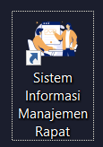
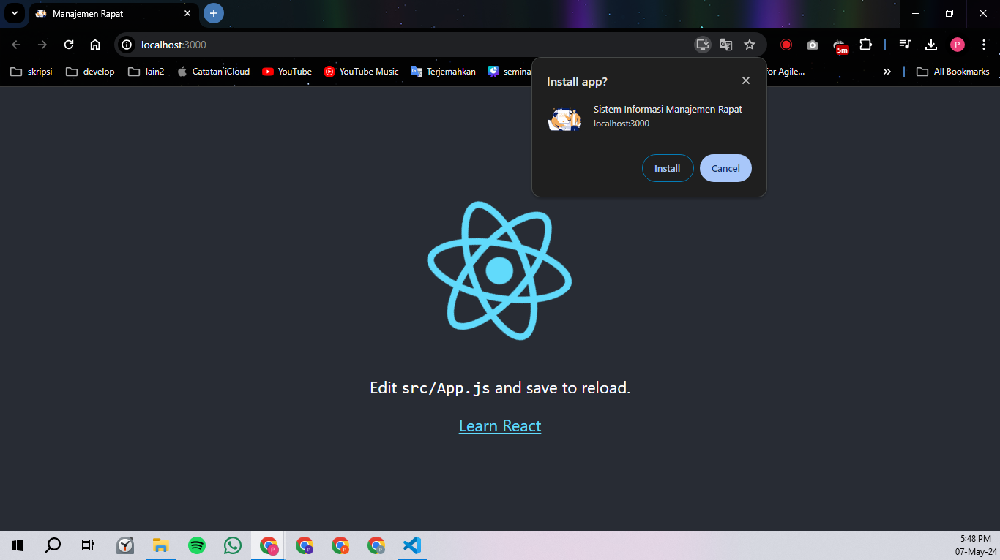
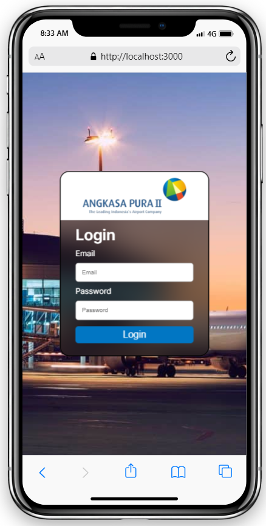
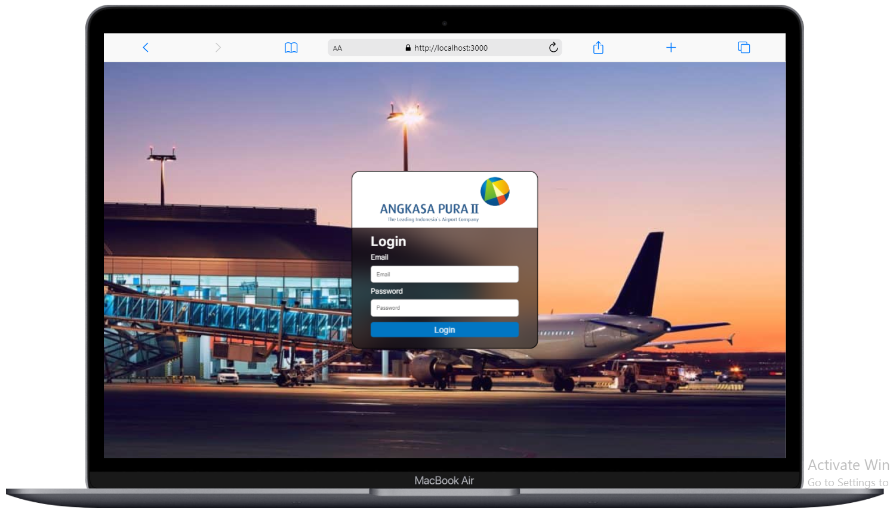

# Dokumentasi Projek Website Manajemen Rapat (SKRIPSI)

## Alur Pembuatan Projek

- node **v18.15.0**
- npm **v9.5.0**
- nodemon **3.1.4**

1. Frontend
   ```
   "@testing-library/jest-dom": "^5.17.0", //ekstensi utk jest yang menyediakan matcher khusus utk DOM, utk menguji komponen react dengan jest
   "@testing-library/react": "^13.4.0", //library utk menguji perilaku dan interaksi komponen react
   "@testing-library/user-event": "^13.5.0", //library utk menstimulasikan interaksi pengguna bersama testing-library/react
   "axios": "^1.7.2", //library HTTP client utk membuat permintaan HTTP, utk berkomunikasi dengan API
   "jwt-decode": "^4.0.0", //Library untuk mendekode JWT tanpa validasi, untuk mengambil payload dari JWT di klien
   "react": "^18.3.1", //library utk membangun antarmuka pengguna, sebagai dasar pembangunan aplikasi frontend
   "react-dom": "^18.3.1", //package utk merender komponen react di DOM digunakan bersama react
   "react-icons": "^5.2.1", //library utk ikon berbasis react
   "react-quill": "^2.0.0", //package utk membuat text editor
   "react-router-dom": "^6.23.0", //library utk routing di aplikasi react, utk mengelola navigasi dan rute
   "react-scripts": "5.0.1", //Skrip dan konfigurasi untuk Create React App, untuk mengelola build dan pengembangan aplikasi React
   "styled-components": "^6.1.11", //Library untuk menulis CSS-in-JS, untuk menulis gaya komponen React dalam JavaScript
   "web-vitals": "^2.1.4", //Library untuk mengukur metrik penting dari kinerja aplikasi web, untuk melacak kinerja aplikasi React
   //workbox- Serangkaian library untuk membuat Progressive Web Apps (PWA) dengan caching dan strategi pemuatan offline, untuk mengimplementasikan berbagai strategi caching dan fitur PWA
   "workbox-background-sync": "^6.6.0",
   "workbox-broadcast-update": "^6.6.0",
   "workbox-cacheable-response": "^6.6.0",
   "workbox-core": "^6.6.0",
   "workbox-expiration": "^6.6.0",
   "workbox-google-analytics": "^6.6.1",
   "workbox-navigation-preload": "^6.6.0",
   "workbox-precaching": "^6.6.0",
   "workbox-range-requests": "^6.6.0",
   "workbox-routing": "^6.6.0",
   "workbox-strategies": "^6.6.0",
   "workbox-streams": "^6.6.0"
   ```
2. Backend
   ```
   "argon2": "^0.40.3", //library untuk hashing dan verifikasi password, untuk mengamankan pass sebelum menyimpannya di database (lebih aman dari bcrypt)
   "connect-session-sequelize": "^7.1.7", //store sesi utk express dan connect yang menggunakan sequelize, utk menyimpan sesi dalam database menggunakan ORM sequalize, harus digunakan bersamaan dengan express-session
   "cookie-parser": "^1.4.6", //middleware mengakses dan memanipulasi cookie yang dikirim oleh client
   "cors": "^2.8.5", //middleware untuk mengaktifkan cors, untuk mengizinkan/membatasi permintaan dari domain lain
   "dotenv": "^16.4.5", //library utk mengelola konfigurasi aplikasi secara aman, utk dapat membaca file .env
   "express": "^4.19.2", //framework web utk node.js, utk membangun aplikasi web dan API
   "express-session": "^1.18.0", //middleware utk mengelola sesi dalam aplikasi express, utk menyimpan data sesi pengguna
   "jsonwebtoken": "^9.0.2", //library utk membuat dan memverifikasi JWT, utk autentikasi dan otorisasi berbasis token
   "mysql2": "^3.10.2", //client utk MySQL dan MariaDB dengan dukungan promosi dan async/await, utk berinteraksi dengan database MySQL
   "sequelize": "^6.37.3" //ORM utk Node.js yang mendukung berbagai database SQL, utk berinteraksi dengan database secara lebih mudah dan terstruktur
   ```

## Instalasi

- Buat folder "PROJECT WEB" di file manajer
- Bikin repository github

_FRONTEND_

- Buat folder "frontend" serta instal React dan mengaktifkan PWA

  `npx create-react-app frontend --template cra-template-pwa`

- Jalankan aplikasi pada browser

  `npm start`

      >Local:            http://localhost:3000

  > On Your Network: http://192.168.56.1:3000

- Install library

  `npm install react-router-dom axios react-icons styled-components react-hook-form jwt-decode`

$env:HTTPS = "true"
npm run build
npm install -g serve
serve -s build


_BACKEND_

- Buat folder "backend" dan package.json

  `npm init -y`

- Instal dependencies

  `npm i express mysql2 sequelize argon2 cors dotenv`

  `npm i express-session connect-session-sequelize`

  `npm i jsonwebtoken cookie-parser`

- Tambahkan type pada package.json

  `"type": "module"` penggunaan module ES (ECMAScript) secara native untuk dapat menggunakan sintaks import/export ES6 daripada CommonJS (require/module.exports)

- Buat index.js dan .env pada folder backend

  `.env`

  ```
  APP_PORT = 5000
  ```

  `index.js`

  ```
  import express from "express"
  import cors from "cors"
  import session from "express-session"

  const app = express()

  app.listen(process.env.APP_PORT, ()=> {
  	console.log('Server up and running...')
  })
  ```

- Jalankan project

  `nodemon index`

- Buat folder config

  `Database.js` utk koneksi ke database MySQL (simara_db)

- Instal dependencies tambahan

  `npm i connect-session-sequelize`

npm install web-push
node generateVapidKeys.js
npm install node-cron


code ngrok : FXFAHARYTBRD5PLLD7JA34P3ZCD6EVAD

C:\Users\ACER\AppData\Roaming\npm
└── ngrok@5.0.0-beta.2
ngrok version 3.14.0
C:\Users\ACER\Documents>ngrok config add-authtoken 2kzRHBtwWhBirK3bZAbswhBlGy8_jVits3XpJs2J9Ctr4Yzg
Authtoken saved to configuration file: C:\Users\ACER\AppData\Local/ngrok/ngrok.yml
 https://ac55-114-10-99-21.ngrok-free.app -> http://localhost:3000 
 https://9e39-114-10-99-43.ngrok-free.app -> http://localhost:3000 

## Pengembangan

### PWA

PWA digunakan untuk membuat website dapat di install dan tampil pada homescreen pengguna.

1. Cari dan download icon yang akan digunakan

   icon.png 500x500

   https://iconscout.com/free-illustration/business-meeting-8044151

   

2. Memperbaiki konfigurasi file `manifest.json`

   ```
   "short_name": "Manajemen Rapat",
   "name": "Sistem Informasi Manajemen Rapat",
   "icons": [
   	{
   	"src": "icon.png",
   	"type": "image/png",
   	"sizes": "500x500"
   	}
   ]
   ```

   Digunakan untuk mengatur interface aplikasi web ketika diinstal pada perangkat pengguna.

   Hasilnya: 

3. Memperbaiki file `index.html`

   ```
   <link rel="icon" href="%PUBLIC_URL%/icon.png" />
   <title>Manajemen Rapat</title>
   ```

   Digunakan untuk mengatur identitas website berupa icon dan nama sistem pada tab di browser.

   Hasilnya: 

4. Mengaktifkan service worker

   Pada file `/front-end/src/index.js` ubah

   ```
   serviceWorkerRegistration.unregister();
   ```

   menjadi

   ```
   serviceWorkerRegistration.register();
   ```

   sehingga aplikasi web dapat di install.

   Hasilnya: 

### Login

1. Pada sisi frontend implementasikan UI pada `Login.js` dan `Login.css`

Hasil




2. Pada sisi backend buat `UserModel.js`, file ini digunakan untuk membuat tabel _users_ dalam database _simara_db_, ketika ingin berinteraksi dan melakukan CRUD dengan tabel _users_ dapat menggunakan model _Users_. pada file `index.js` import `UserModel.js` dan tambahkan code await Users.sync()

   > saat ini sementara menggunakan simr_db

3. Pada sisi backend buat `Users.js` pada folder controllers sebagai sebuah modul controller untuk mengelola data pengguna dalam aplikasi Node.js menggunakan Sequelize sebagai ORM dan argon2 untuk hashing password

4. Pada sisi backend, buat `UserRoute.js` untuk mendefinisikan endpoint atau rute HTTP yang terkait dengan operasi pengguna (users). File ini mengatur rute HTTP dan mengaitkannya dengan fungsi-fungsi controller yang mengelola logika bisnis untuk setiap operasi. pada file `index.js` tambahkan code app.use(UserRoute) dan import `UserRoute.js`

5. Pada sisi backend, buat `Auth.js` pada folder controlles untuk mengelola proses autentikai pengguna seperti login, cerifikasi status login, dan logout

6. Pada sisi backend, buat `AuthRoute.js` untuk mengatur endpoint atau jalur yang dapat diakses oleh klien untuk melakukan login, logout, dan memeriksa status login. pada file `index.js` tambahkan code app.use(AuthRoute) dan import `AuthRoute.js`

7. Pada sisi backend, install connect-session-sequelize dan import pada file `index.js`

8. Pada sisi backend, tambahkan `AuthUser.js`pada folder middleware untuk mengelola autentikasi dan otorisasi pengguna dalam aplikasi, middleware ini digunakan untuk melindungi rute tertentu agar hanya dapat diakses oleh pengguna yang terautentikasi dan memiliki hak akses yang sesuai

### Home

1. Pada sisi frontend implementasikan UI navbar superadmin `NavbarSAdmin` pada folder components.
   Hasil
